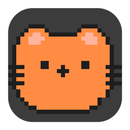

# Mochi 桌面宠物 🐱

一个可爱的跨平台桌面宠物应用，支持 macOS 和 Windows。



## 功能特性

- 🐱 **可爱的像素风猫咪** - 多种毛色可选（橘猫、黑猫、三花、虎斑、白猫、灰猫）
- 💬 **AI 聊天** - 支持接入通义千问、豆包、Kimi 等国内大模型
- 🎨 **换肤功能** - 右键点击即可切换不同毛色
- 🍖 **互动功能** - 喂食、摸摸、聊天
- 🖱️ **鼠标穿透模式** - 开启后不影响桌面操作
- 🪟 **固定在桌面** - 始终显示在桌面角落，不会被其他窗口遮挡
- 🔔 **系统托盘** - 支持 Dock/任务栏图标，方便退出

## 下载安装

### macOS

1. 下载最新版本的 `Mochi-macOS.dmg`
2. 双击打开 DMG 文件
3. 将 Mochi.app 拖到 Applications 文件夹
4. 首次运行请在系统偏好设置中允许打开

### Windows

1. 下载最新版本的 `Mochi-Windows.zip`
2. 解压到任意位置
3. 双击 `Mochi.exe` 运行

## 从源码运行

### 环境要求

- Python 3.8+
- PyQt5
- PyQtWebEngine

### 安装依赖

```bash
pip install PyQt5 PyQtWebEngine
```

### 运行

```bash
python src/mochi_app.py
```

## 打包应用

### macOS

```bash
pip install pyinstaller
pyinstaller build/Mochi_macOS.spec
```

打包完成后在 `dist/` 目录找到 `Mochi.app`。

### Windows

```bash
pip install pyinstaller
pyinstaller build/Mochi_Windows.spec
```

打包完成后在 `dist/` 目录找到 `Mochi.exe`。

## 配置 AI 聊天

1. 右键点击小猫 → API 设置
2. 选择 AI 提供商（通义千问、豆包等）
3. 输入 API Key（从对应官网获取）
4. 点击保存

### 获取 API Key

- **通义千问**: [阿里云百炼](https://bailian.console.aliyun.com)
- **豆包**: [火山引擎](https://console.volcengine.com)
- **Kimi**: [Moonshot AI](https://platform.moonshot.cn)
- **文心一言**: [百度千帆](https://qianfan.baidu.com)

## 项目结构

```
Mochi/
├── src/
│   └── mochi_app.py          # 主程序
├── resources/
│   ├── index.html            # 宠物界面
│   ├── pet.js               # 宠物逻辑
│   ├── config.js            # 配置文件
│   ├── icon.icns            # macOS 图标
│   ├── icon.ico             # Windows 图标
│   └── icon_preview_v7.png  # 预览图标
├── build/
│   ├── Mochi_macOS.spec     # macOS 打包配置
│   └── Mochi_Windows.spec   # Windows 打包配置
├── .github/
│   └── workflows/
│       └── build.yml        # 自动打包配置
└── README.md
```

## 技术栈

- **Python 3.8+** - 后端逻辑
- **PyQt5** - GUI 框架
- **QWebEngineView** - 嵌入 Web 内容
- **HTML/CSS/JavaScript** - 宠物界面和动画

## 跨平台支持

| 功能 | macOS | Windows |
|------|-------|---------|
| 桌面固定 | ✅ | ✅ |
| 透明背景 | ✅ | ✅ |
| 系统托盘 | ✅ | ✅ |
| 鼠标穿透 | ✅ | ✅ |
| 窗口置顶 | ✅ | ✅ |

## 开发计划

- [ ] 添加更多宠物形象（狗狗、兔子等）
- [ ] 支持自定义宠物图片
- [ ] 添加更多互动动作
- [ ] 支持语音输入
- [ ] 添加日程提醒功能

## 许可证

MIT License

## 致谢

- 图标设计：[你的设计来源]
- 灵感来源：[BongoCat](https://bongocat.gjxx.dev/)

---

Made with ❤️ by [你的名字]
